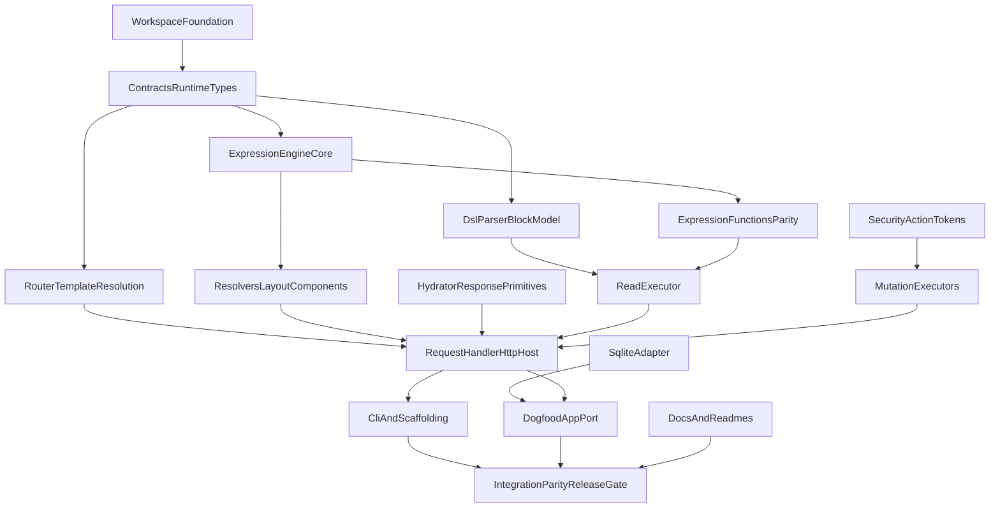

# HTX TypeScript Port Master Plan

**Status:** COMPLETE  
**Scope:** Full monorepo Bun/TypeScript rewrite of the PHP HTX codebase  
**Primary rule:** PHP is the behavioral specification unless a difference is explicitly documented as intentional.

## Outcome

Deliver a TypeScript monorepo that preserves PHP HTX semantics across:

- `packages/htx-engine`
- `packages/htx-adapter-sqlite`
- `packages/htx-cli`
- `app/` dogfood application
- root and package README surfaces
- parity and release validation

## Non-goals

- Porting Postgres, Supabase, Turso, or Neon in the first execution wave
- Designing a new template language or changing HTX tag syntax
- Building a rendered docs site before core parity is proven
- Introducing framework abstractions on top of `Bun.serve()`

## Allowed intentional deviations

- Stronger TypeScript types, including discriminated unions and `unknown`
- Bun-native APIs instead of PHP runtime helpers
- A documented decision on JWT sync vs async behavior at the request boundary

## Monorepo target

```text
hypermedia-app-ts/
  package.json
  tsconfig.base.json
  packages/
    htx-engine/
    htx-adapter-sqlite/
    htx-cli/
  app/
    config.ts
    public/
    templates/
  README.md
```

## Package map

- `packages/htx-engine`: contracts, expressions, parser, runtime, executors, security, services
- `packages/htx-adapter-sqlite`: Bun SQLite reference adapter
- `packages/htx-cli`: `htx new`, `htx dev`, `htx serve`
- `app`: dogfood app bootstrap, templates, assets, local config
- docs surfaces: root README plus package READMEs

## Phase order

1. Workspace foundation
2. Contracts and runtime types
3. Expression engine core
4. Expression functions parity
5. DSL parser and block model
6. Router and template resolution
7. Resolvers, layouts, components
8. Hydrator and response primitives
9. Security and action tokens
10. Read executor
11. Mutation executors
12. RequestHandler and HTTP host
13. SQLite adapter
14. CLI and scaffolding
15. Dogfood app port
16. Docs and package READMEs
17. Integration parity and release gate

## Dependency model



## Why this order

- Contracts move early so parser, router, executors, and handler reuse one source of truth.
- Request orchestration is a dedicated deliverable, not hidden inside integration work.
- SQLite lands after core engine surfaces exist, so adapter behavior can be validated against real executors and the app.
- CLI and dogfood app are downstream consumers of the same runtime path.

## Execution rules

- Each phase must cite exact PHP source files and exact TypeScript target files.
- No phase is complete until its parity gates and listed tests pass.
- If a PHP behavior is unclear, resolve it by reading PHP source before inventing new semantics.
- Keep HTX tag syntax aligned with PHP: `<htx:include>`, `<htx:component>`, `<htx:let>`, meta directives, and response tags.

## High-risk parity zones

- `RequestHandler` pipeline order
- `ContentAdapter.query()` return shape and `where` string semantics
- Router catch-all and `TemplateResolver` multi-root behavior
- Reverse-order DSL block replacement
- Mutation token field naming, replay protection, and IDOR checks
- SQLite schema, indexes, slug generation, and JSON meta flattening

## Release checklist

- Engine unit and integration parity tests pass
- SQLite adapter tests pass against `:memory:` and file-backed databases
- CLI commands run through the real runtime path
- Dogfood app boots and serves static assets, public pages, and admin mutations
- Root README and package READMEs reflect Bun/TypeScript usage
- Package exports are installable and usable from a clean Bun project

## Final validation artifacts

- Parity matrix: `hypermedia-app-ts/.plans/ACTIONABLE/ts-port-parity-matrix.md`
- Final validation commands:
  - `bun run typecheck`
  - `bun test`

## Execution log

- [x] Planning suite created
- [x] Phase docs reviewed for dependency consistency
- [x] Ready for implementation execution
- [x] All 17 implementation phases completed
- [x] Release gate satisfied by final parity validation
- [x] Completion audit: line-by-line PHP comparison identified 10 parity gaps
- [x] Phase A: fixed per-row fault tolerance, layout resilience, error logging, UTC docs
- [x] Phase B: fixed router param validation, circular include messages, nests audit
- [x] Phase C: fixed consumer-install test (CLI binary PATH resolution)
- [x] Phase D: updated parity matrix, engine README with deviations section
- [x] Final state: 76 tests, 0 failures, 262 assertions, strict typecheck passes
