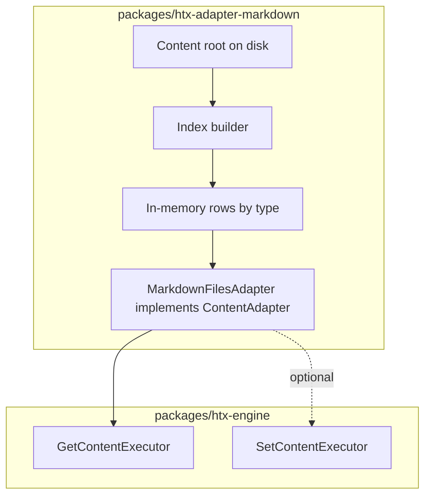

# Markdown / flat-file `ContentAdapter` — master plan

**Status:** NOT STARTED  
**Location:** New workspace package (proposed: `packages/htx-adapter-markdown` or `packages/htx-adapter-files`)  
**Depends on:** Existing [`ContentAdapter`](../packages/htx-engine/src/contracts/content-adapter.ts) contract and [`SQLiteAdapter`](../packages/htx-adapter-sqlite/src/sqlite-adapter.ts) as behavioral reference  

---

## Purpose

Add an adapter that uses **markdown files on disk** (with optional YAML front matter) as the backing store for HTX `<htx:type>`, `<htx:where>`, `<htx:order>`, `<htx:slug>`, and related directives—**without** SQLite. This matches the engine’s rule that **data lives behind `ContentAdapter`**; templates stay `.htx`; content can live as `.md` (or similar) in a content tree.

This document is the **master plan**; phases below are a suggested execution order.

---

## Goals

1. **Implement `ContentAdapter`** so existing `GetContentExecutor`, mutations (if enabled), and templates work unchanged.
2. **Deterministic layout** — document where files live, how `type` and `slug` map to paths, and how front matter maps to `ContentRow` fields.
3. **Query parity (read path)** — `query`, `find`, `findBySlug` behave like [`SQLiteAdapter`](../packages/htx-adapter-sqlite/src/sqlite-adapter.ts) for the same `QueryMeta` shapes (`where` as comma-separated string, `order` keywords, `howmany`, `offset`, `fields`).
4. **Tests** — unit tests for indexing, filtering, ordering; integration smoke with `InMemoryAdapter`-level coverage plus optional dogfood scenario.

## Non-goals (initially)

- **Full CMS** with media pipelines, scheduled publishing, or relational joins across types.
- **Git integration** (history, branches) — can be a later phase.
- **Parity with every edge case** of `SQLiteAdapter` if a behavior is inherently file-system-specific (document deviations).

---

## Design axes (decide in Phase 1)

### 1. Directory convention

Proposed default (familiar from static-site generators):

```text
content/
  post/
    hello-world.md
    another-post.md
  page/
    about.md
```

- **`type`** from HTX meta maps to a **subdirectory** under `content/<type>/`.
- **`slug`** comes from front matter `slug` or from the filename without extension (e.g. `hello-world.md` → `hello-world`).

Alternative: single flat `content/*.md` with `type` and `slug` only in front matter—simpler for small sites, harder to browse.

### 2. File format

- **Front matter:** YAML between `---` delimiters (same ecosystem as most Markdown tooling).
- **Body:** Markdown string → maps to **`body`** on the row; templates often use `body` or render via expression `md(body)`.
- **System fields** aligned with SQLite adapter: `title`, `body`, `status`, `slug`, `created_at`, `updated_at`, plus **`id`** (see below).

Extra front matter keys merge into the row (same idea as `meta` JSON merge in `SQLiteAdapter.decodeRow`).

### 3. Stable `id`

SQLite uses integer `id`. Files have no natural integer. Options:

| Strategy | Pros | Cons |
|----------|------|------|
| **String id = slug** (scoped by type) | Simple, stable URLs | Collides if slug renamed |
| **Hash of `(type, relativePath)`** | Stable for path | Opaque in admin UIs |
| **UUID in front matter** | Globally unique | Must be authored |

**Recommendation:** Use **`id` in front matter** when present; otherwise derive **`${type}:${slug}`** or a numeric hash documented in the adapter—**must be stable across process restarts** for `find(type, id)`.

### 4. Mutations (`create` / `update` / `delete`)

Two product modes:

| Mode | Behavior | Use case |
|------|----------|----------|
| **Read-only** | `create` / `update` / `delete` throw `Error` with a clear message, or a dedicated `ReadOnlyContentAdapter` base | Docs, marketing sites, CI builds |
| **Read-write** | Write `.md` files atomically (`fs.writeFileSync` + temp file rename), update front matter + body | Local authoring, small apps |

**Recommendation:** Ship **read-only MVP first** (Phase 3–4), add **optional writes** behind a flag or subclass in a later phase (Phase 5).

### 5. Indexing and performance

- On construction (or first query), **walk the content root**, parse front matter, build an **in-memory index**: list of `ContentRow` per `type`, plus maps for `slug` and `id`.
- Optional: **`fs.watch`** (or manual `reload()` method) for dev server—**not** required for v1.
- Large sites: document **max file count** or add lazy loading in a later iteration.

### 6. `where` / `order` parity

Mirror [`SQLiteAdapter`](../packages/htx-adapter-sqlite/src/sqlite-adapter.ts):

- **`where`:** comma-separated conditions; `field=value`, operators `!=`, `>=`, `<=`, `>`, `<` for system columns; custom fields resolved against merged row (equivalent to `json_extract` on meta in SQL—here use **object property** lookup on the row after merge).
- **`order`:** support at least `newest`, `oldest`, `alphabetical` / `alpha`, `alpha_desc`, `updated`—same keywords as SQLite adapter.

### 7. `schema()`

Return `null` like SQLite for freeform mode, or optional static schema later.

---

## Architecture sketch



---

## Phased approach

### Phase 1 — Design lock-in

**Deliverables**

- Final **directory + filename** rules and one **example file** (with front matter) per type pattern.
- **ID and slug** rules documented.
- **Parity matrix** subsection: which `SQLiteAdapter` behaviors are replicated vs deferred (e.g. random order).
- Decision: **read-only v1** vs **writes in scope** for first release.

**Exit:** Short “ADR-style” section appended to this file or a linked `htx-adapter-markdown-adr.md` in the same folder.

---

### Phase 2 — Package scaffold

**Deliverables**

- `packages/htx-adapter-markdown/` (name TBD) with `package.json`, `tsconfig.json`, dependency on `@htx/engine`.
- Public export: `MarkdownFilesAdapter` (or `FlatFileMarkdownAdapter`).
- No logic yet beyond constructor accepting **`contentRoot: string`** and optional **`{ readOnly?: boolean }`**.

**Exit:** `bun test` runs (empty or smoke import test).

---

### Phase 3 — Parse and index (read model)

**Deliverables**

- Recursive **`readdir`** + filter `*.md` (configurable extension list).
- **Front matter parser** — YAML only for v1; can use a minimal dependency (e.g. `yaml` package) or reuse engine utilities if present; avoid dragging full CMS deps.
- **Markdown body** extraction: everything after closing `---` of front matter.
- Build **`Map<type, ContentRow[]>`** and slug/id indexes.
- **`mtime`** from `fs.statSync` for `created_at` / `updated_at` if not in front matter (document mapping).

**Exit:** Unit tests: single file, multiple types, missing optional fields, UTF-8 content.

---

### Phase 4 — `ContentAdapter` read API

**Deliverables**

- `query(meta)` — filter by `type`, `slug`, `where`, apply `order`, `offset`, `howmany`, `fields` (mirror SQLite).
- `find(type, id)` / `findBySlug(type, slug)`.
- `schema()` → `null`.

**Exit:** Port or mirror assertions from [`sqlite-adapter.test.ts`](../packages/htx-adapter-sqlite/tests/sqlite-adapter.test.ts) where applicable (adapt expected ids/slugs).

---

### Phase 5 — Mutations (optional; if not deferred)

**Deliverables**

- `create` → write new file under `content/<type>/<slug>.md`.
- `update` → rewrite file preserving order of front matter or stable key order.
- `delete` → unlink file.
- **Concurrency:** single-process assumption documented; optional file lock or “best effort” for v1.

**Exit:** Tests in a temp directory (`mkdtempSync` + teardown).

If Phase 1 chose **read-only only**, replace this phase with **explicit errors** and tests that `create`/`update`/`delete` throw.

---

### Phase 6 — CLI / app integration

**Deliverables**

- **`htx` / scaffold** option or env: `CONTENT_ADAPTER=markdown` + `CONTENT_ROOT=./content` (exact API to match existing config patterns in [`htx-cli`](../packages/htx-cli)).
- [`serve-command`](../packages/htx-cli/src/commands/serve-command.ts) (or config loader) wires `MarkdownFilesAdapter` instead of `SQLiteAdapter` when selected.
- README snippet for **dogfood** or sample project.

**Exit:** Manual smoke: `bun run dev` with markdown content shows list + detail pages.

---

### Phase 7 — Documentation and release

**Deliverables**

- Package `README.md`: layout, front matter schema, read-only vs write, limitations.
- Root [`README.md`](../README.md) bullet under adapters.
- Changelog / version bump policy aligned with workspace.

**Exit:** Review against [`ts-port-synthesis.md`](./ts-port-synthesis.md) — adapter fits “pluggable backends” story.

---

## Risks and mitigations

| Risk | Mitigation |
|------|------------|
| `where` string semantics drift from SQLite | Share tests or a tiny shared test vector file used by both adapters |
| Write path corrupts files | Atomic rename; backup note in README |
| Performance on huge trees | Document limits; Phase 2+ index caching / watch |
| ID mismatch in mutations / tokens | Align with `ActionTokenService` record binding—**read-only** mode avoids mutations until IDs are stable |

---

## Execution log

- [ ] Phase 1 — Design lock-in  
- [ ] Phase 2 — Package scaffold  
- [ ] Phase 3 — Parse and index  
- [ ] Phase 4 — Read API  
- [ ] Phase 5 — Mutations or read-only enforcement  
- [ ] Phase 6 — CLI / app integration  
- [ ] Phase 7 — Docs and release  

---

## Related documents

- [`ts-port-synthesis.md`](./ts-port-synthesis.md) — overall TS port viability  
- [`SQLiteAdapter`](../packages/htx-adapter-sqlite/src/sqlite-adapter.ts) — reference behavior for queries  
